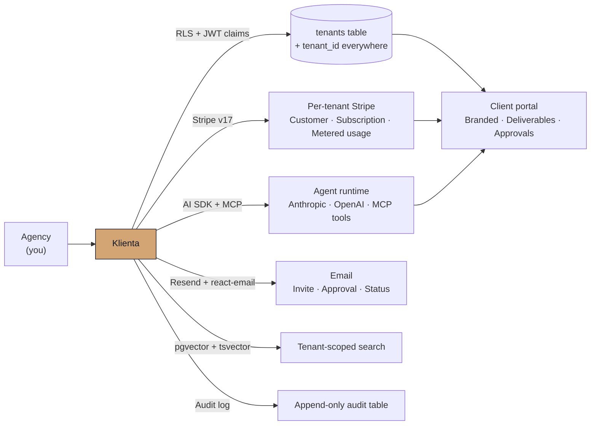

<div align="center">


# Klienta

**White-label client portals for AI agencies.**
Multi-tenant Next.js + Supabase + Stripe + per-tenant agent runtime — ship features instead of plumbing.

[](./EULA.md)
[](#the-stack)
[](#how-it-composes)
[](https://byteworthy.io/blueprints/klienta)

[**Get a license&nbsp;→**](https://byteworthy.io/blueprints/klienta)
&nbsp;·&nbsp; [Product page](https://byteworthy.io/blueprints/klienta)
&nbsp;·&nbsp; [What ships](#what-ships-in-the-boilerplate)
&nbsp;·&nbsp; [Quick start](#quick-start-after-license)
&nbsp;·&nbsp; [FAQ](#faq)

</div>

---

> **Klienta** is a commercial Next.js 15 + Supabase boilerplate for AI agencies that need to give every client a branded portal. It ships multi-tenant auth with row-level security, Stripe billing per tenant, a Go-based worker, and a pluggable agent runtime built on the Vercel AI SDK and Model Context Protocol. The goal is simple: skip the ~3 months of plumbing, start charging tenants in week two.

---

## Why agencies buy this instead of building it

Wiring multi-tenant auth, per-tenant Stripe subscriptions, isolated agent secrets, deliverables flows, audit logging, and a white-label theme system from scratch is a quarter-long project before you write your first product feature. Then you have to do it again for the next client.

Klienta hands you the plumbing in one repo, with the migrations, the seed scripts, and the deploy guide already written. You take the source, plug in your own keys, run `pnpm dev`, and your second hour is spent on the part of the product that actually differentiates your agency.

It is **not** a SaaS. There is no monthly fee to ByteWorthy after purchase, no platform lock-in, no telemetry phoning home. You self-host on your own Vercel + Supabase + Stripe accounts, and you keep the source forever.

## What ships in the boilerplate

Every row below maps to real files in the provisioned source tree. Nothing here is aspirational.

| Module | Implementation |
|---|---|
| Multi-tenant Supabase Auth (magic link + OAuth) | `@supabase/ssr` + middleware injecting `tenant_id` JWT claim on every request |
| Row-level security on every tenant-scoped table | Supabase migrations: `20260412004330_initial_schema.sql` and onward |
| White-label theming per tenant | `tenant.theme` config: logo, brand colors, custom domain, email-from address |
| Stripe Customer + Subscription per tenant | Stripe v17 SDK, webhook handler, circuit breaker, plan registry, billing portal embed |
| Metered usage billing | Per-tenant aggregation API at `/api/metering/*`, retry queue, idempotent event ingestion |
| Per-tenant agent runtime | Vercel AI SDK (Anthropic + OpenAI) + Model Context Protocol server, isolated per-tenant queues |
| MCP tool integration | `@modelcontextprotocol/sdk` client + server scaffolding in the agent runtime |
| Per-tenant API key vault | Encrypted secrets table + tenant-scoped retrieval helpers |
| Client deliverables portal | `components/portal/deliverable-list.tsx` — upload, version, render, download-gate |
| Project board + milestones | Workspace pages with status, owner, due dates, comment threads |
| Approval flows | Sign-off threads with status gates and audit trail |
| Agency admin dashboard | All tenants, usage rollups, billing status, support actions |
| Onboarding wizard | Tenant setup in under 10 minutes — branding, billing, first invite |
| Immutable audit log | Append-only table on every tenant action with before/after diff |
| Email notifications | Resend + `@react-email/components` templates (invite, approval, status change) |
| Vector + full-text search | pgvector + tsvector migration for tenant-scoped search |
| Rate limiting | Upstash Redis ratelimit on auth, billing, and agent endpoints |
| Observability | Sentry (Next.js + worker) + PostHog product analytics, both wired |
| Background worker | Go worker in `packages/worker` for long-running agent jobs |
| `.env.example` with full reference | Every required key, with comments and provisioning notes |
| Deployment guide | Vercel + Supabase + Stripe step-by-step, with smoke-check script |

## How it composes



## Klienta vs building from scratch

| | Building from scratch | Klienta |
|---|---|---|
| Multi-tenant auth + RLS | Pick Auth0 or hand-roll Postgres policies, then debug edge cases for weeks | `@supabase/ssr` + RLS migrations shipped, JWT `tenant_id` claim wired |
| Per-tenant billing | Stripe integration, webhook routing, plan logic, circuit breaker | All of that, in `lib/billing/{plans,actions,client,webhook,circuit-breaker}.ts` |
| Metered usage | Build the event pipeline yourself | `/api/metering/{event,aggregate,retry}` already in the codebase |
| White-label branding | CSS overrides + DNS per client, manually | `tenant.theme` config, middleware-resolved per request |
| Agent runtime per tenant | Custom queue + secrets isolation + MCP server | Isolated per-tenant queues, encrypted key vault, MCP scaffolding |
| Deliverables + approvals | Build from scratch | Ships in `components/portal/*` and `components/workspace/*` |
| Email templates | Pick a service, write templates, test deliverability | Resend + react-email templates included |
| Audit logging | Roll your own + pray it survives a SOC2 review | Append-only table + per-action helpers shipped |
| Time to first paying tenant | ~3 months of pure plumbing | ~2 weeks |

## Quick start (after license)

```bash
git clone <provisioned-repo-url> klienta
cd klienta
pnpm install
cp packages/web/.env.example packages/web/.env.local
# Required: NEXT_PUBLIC_SUPABASE_URL, SUPABASE_SERVICE_ROLE_KEY,
#           STRIPE_SECRET_KEY, STRIPE_WEBHOOK_SECRET, RESEND_API_KEY
pnpm dev          # web app at http://localhost:3000
pnpm go:dev       # worker (Go) at :8080
```

Onboard your first tenant:

```bash
pnpm onboarding:day0       # bootstrap an empty tenant + admin invite
pnpm staging:smoke         # end-to-end smoke check against staging
```

> Source code is provisioned to a private GitHub repository after license purchase at [byteworthy.io/blueprints/klienta](https://byteworthy.io/blueprints/klienta).

## The stack

| Layer | Technology |
|---|---|
| Framework | [Next.js](https://nextjs.org) 15 (App Router, Turbopack dev) |
| Language | TypeScript (strict) · Go for the worker |
| Auth + DB | [Supabase](https://supabase.com) — Postgres, Auth, Storage, RLS, Realtime |
| Billing | [Stripe](https://stripe.com) v17 — Subscriptions, Metered billing, Customer Portal |
| Agent SDK | [Vercel AI SDK](https://ai-sdk.dev) v6 — Anthropic + OpenAI providers |
| Tool protocol | [Model Context Protocol](https://modelcontextprotocol.io) — `@modelcontextprotocol/sdk` |
| UI | [Radix UI](https://www.radix-ui.com) primitives + [shadcn-style](https://ui.shadcn.com) components |
| Styling | [Tailwind CSS](https://tailwindcss.com) + [framer-motion](https://www.framer.com/motion) |
| Email | [Resend](https://resend.com) + [@react-email/components](https://react.email) |
| Search | pgvector + Postgres tsvector |
| Rate limiting | [Upstash Redis](https://upstash.com) + `@upstash/ratelimit` |
| Observability | [Sentry](https://sentry.io) (web + worker) · [PostHog](https://posthog.com) (product analytics) |
| Worker | Go (`packages/worker`) for long-running agent jobs |
| Deployment | [Vercel](https://vercel.com) (web) + Supabase Cloud (DB) + Fly.io / Railway / Render (worker) |
| Package manager | pnpm 9, monorepo workspaces |

## Who this is for

Klienta is the right fit if **all** of these are true:

- You're an AI agency, dev shop, or solo operator with **multiple paying clients**
- Each client wants their own portal — branded, isolated, billable
- You're sending deliverables today by Slack, Notion, or shared drive
- You'd rather spend the next month shipping product than wiring auth, billing, and RLS

It is **not** the right fit if:

- You're building a single-tenant SaaS — you don't need multi-tenant plumbing
- You're building a consumer app — the portal model assumes B2B clients
- You need a no-code platform — Klienta is source-available code, you'll edit it

## Pricing and access

One-time commercial license. Source code included. Self-host on your own Vercel + Supabase + Stripe accounts. No monthly seat fee to ByteWorthy.

[**See current pricing tiers&nbsp;→**](https://byteworthy.io/blueprints/klienta)

After purchase, source is provisioned to a private GitHub repository invited to your account.

## Security

Report vulnerabilities privately to [security@byteworthy.io](mailto:security@byteworthy.io). Do not file public issues for security topics. See [`SECURITY.md`](./SECURITY.md) for the full disclosure policy.

This repo is the public trust surface — license, terms, security policy, public roadmap. The source repo is private; access is provisioned after license purchase.

## FAQ

<details>
<summary><strong>Is this a SaaS, or do I get the source?</strong></summary>

You get the source, in a private GitHub repository invited to your account after purchase. Self-host on your own Vercel + Supabase + Stripe accounts. There is no Klienta-hosted runtime to depend on, no monthly fee to ByteWorthy, no telemetry phoning home.
</details>

<details>
<summary><strong>What's actually in the box on day one?</strong></summary>

Every row in the [What ships](#what-ships-in-the-boilerplate) table maps to real files in the provisioned source tree. We don't ship aspirational features. The migrations are real, the Stripe webhook handler is real, the agent runtime is real, the deploy guide is the one we use to deploy it ourselves.
</details>

<details>
<summary><strong>Can I white-label this for my agency?</strong></summary>

Yes — that's the point. Per-tenant theming (logo, colors, custom domain, email-from) is a config table resolved by middleware on every request. Each of your clients gets their own brand surface without forking the codebase. The agency-level brand (yours) is a separate config layer above tenants.
</details>

<details>
<summary><strong>Do I need Supabase Cloud, or can I self-host?</strong></summary>

Both work. Supabase Cloud is the lowest-friction path and what the deploy guide assumes. Self-hosted Supabase works the same — point `NEXT_PUBLIC_SUPABASE_URL` at your instance and the migrations apply identically.
</details>

<details>
<summary><strong>How does the agent runtime work?</strong></summary>

Klienta uses the [Vercel AI SDK](https://ai-sdk.dev) for provider-agnostic LLM calls (Anthropic + OpenAI shipped, swap in others) and the [Model Context Protocol](https://modelcontextprotocol.io) for tool integration. Each tenant gets isolated queues, an encrypted API-key vault, and per-tenant invocation logs. Long-running jobs run on the Go worker in `packages/worker`.
</details>

<details>
<summary><strong>Does it handle PHI / HIPAA workloads?</strong></summary>

No — Klienta is the general-purpose agency portal boilerplate. For HIPAA-grade workloads (PHI encryption, BAA workflows, FHIR R4 / HL7 v2 / X12 EDI), see the sister boilerplate **[Clynova](https://github.com/ByteWorthyLLC/clynova)**. Both are in the same family and share the underlying multi-tenant primitives.
</details>

<details>
<summary><strong>Can I see the source before buying?</strong></summary>

Yes — schedule a walkthrough via [byteworthy.io/contact](https://byteworthy.io/contact). For a smaller signal, the open-source sibling [Sovra](https://github.com/ByteWorthyLLC/sovra) shares the same multi-tenant architectural patterns and is fully readable.
</details>

<details>
<summary><strong>What if I want a feature that isn't shipped?</strong></summary>

You own the source. Edit it. We accept change requests for the upstream boilerplate via a private support channel after purchase, but you're never blocked on us — fork is the default path.
</details>

## Related projects · the ByteWorthy boilerplate family

Three blueprints, one architectural lineage. Pick the one that matches your buyer.

| Boilerplate | For | License |
|---|---|---|
| **[Sovra](https://github.com/ByteWorthyLLC/sovra)** | Open-source multi-tenant foundation. Auth, billing, MCP tools, pgvector. The free starting point. | MIT |
| **Klienta** *(this repo)* | White-label client portal for AI agencies. Per-tenant brand, deliverables, approvals. | Commercial |
| **[Clynova](https://github.com/ByteWorthyLLC/clynova)** | HIPAA-ready healthcare AI. PHI encryption, BAA workflows, FHIR R4 + HL7 v2 + X12 EDI. | Commercial |

ByteWorthy also ships **open-source AI security tools** alongside the boilerplate family:

- **[honeypot-med](https://github.com/ByteWorthyLLC/honeypot-med)** — prompt-injection evidence for healthcare AI workflows
- **[byteworthy-defend](https://github.com/ByteWorthyLLC/byteworthy-defend)** — open-source CLI antivirus for Windows + Linux
- **[vqol](https://github.com/ByteWorthyLLC/vqol)** — patient-owned VEINES-QOL/Sym tracker
- **[hightimized](https://github.com/ByteWorthyLLC/hightimized)** — audit a hospital bill, generate a dispute letter (browser-only)
- **[outbreaktinder](https://github.com/ByteWorthyLLC/outbreaktinder)** — historic public-health events as a swipe deck

## Surfaces

| Surface | URL |
|---|---|
| Product page | [byteworthy.io/blueprints/klienta](https://byteworthy.io/blueprints/klienta) |
| Live site | [byteworthy.io/blueprints/klienta](https://byteworthy.io/blueprints/klienta) |
| EULA | [`EULA.md`](./EULA.md) |
| Terms | [`TERMS.md`](./TERMS.md) |
| Security policy | [`SECURITY.md`](./SECURITY.md) |
| Public roadmap | [`ROADMAP.md`](./ROADMAP.md) |
| Sales / fulfillment flow | [`SALES-FLOW.md`](./SALES-FLOW.md) |
| `llms.txt` | [`llms.txt`](./llms.txt) |
| Contact | [byteworthy.io/contact](https://byteworthy.io/contact) |

## Maintainer

Built and maintained by **[ByteWorthy LLC](https://byteworthy.io)** — blueprints and open-source tools for AI builders.

[Contributing](./CHANGELOG.md) · [Security policy](./SECURITY.md) · [EULA](./EULA.md) · [Terms](./TERMS.md)

<div align="center">
  <sub>Source-available · self-hosted · no platform lock-in · no telemetry</sub><br/>
  <sub><a href="#klienta">⬆ back to top</a></sub>
</div>
