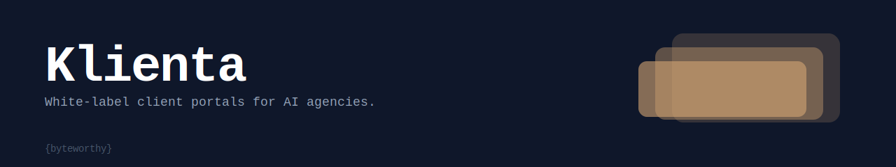
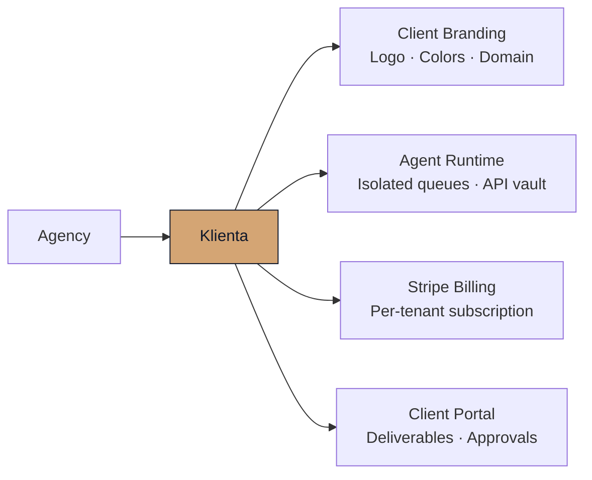

<div align="center">



# Klienta

**White-label client portals for AI agencies. Built for multi-tenant, launch-ready in 2 weeks.**

[](./EULA.md)
[](https://byteworthy.io/boilerplates/klienta)

[**Get a license →**](https://byteworthy.io/boilerplates/klienta) &nbsp;·&nbsp; [Docs](https://byteworthy.io/boilerplates/klienta/docs) &nbsp;·&nbsp; [Contact](https://byteworthy.io/contact)

</div>

---

> **Klienta** is a white-label client portal boilerplate for AI agencies. It ships multi-tenant Next.js + Supabase auth, Stripe billing per tenant, and a per-tenant agent runtime — replacing the four-month build cycle of wiring Auth0, Stripe, custom RLS, and a deliverables UI from scratch. Built for agencies that need to give each client a branded portal to view deliverables, manage projects, approve work, and interact with agents.

## What agencies build with Klienta

| Feature | What it replaces | Time saved |
|---|---|---|
| Supabase Auth + RLS per tenant, `tenant_id` on every table, JWT claims scoped per tenant | Custom multi-tenant auth from scratch | ~3 weeks |
| White-label theming per client — logo, colors, domain, email from address | Manual CSS overrides per client deployment | ~1 week |
| Stripe Customer + Subscription per tenant, metered usage webhooks, billing portal embed | Payment integration and subscription management | ~1 week |
| Per-tenant agent runtime hooks — isolated queues, per-tenant API key vault, agent invocation API | Custom agent wiring and secrets management | ~2 weeks |
| Client deliverables portal — file uploads, report rendering, version history, download controls | File sharing and report delivery system | ~2 weeks |
| Project status board + approval flows — milestone tracking, client sign-off, comment threads | Custom workflow and approval UI | ~1 week |

## How it composes



## Quick start (after purchase)

```bash
git clone <provisioned-repo-url> klienta
cd klienta
pnpm install
cp .env.example .env.local
# Required: NEXT_PUBLIC_SUPABASE_URL, SUPABASE_SERVICE_KEY, STRIPE_SECRET_KEY
pnpm dev
```

> Source is provisioned after license purchase at [byteworthy.io/boilerplates/klienta](https://byteworthy.io/boilerplates/klienta).

## What ships in the boilerplate

| Module | Included |
|---|---|
| Multi-tenant Supabase Auth (magic link + OAuth) | ✓ |
| Row-level security policies on all tenant-scoped tables | ✓ |
| JWT claims middleware — tenant_id injected at auth time | ✓ |
| White-label theme config — per-tenant logo, colors, custom domain, email from | ✓ |
| Stripe Customer + Subscription per tenant (create, cancel, portal) | ✓ |
| Metered usage billing hooks — track agent invocations per tenant | ✓ |
| Per-tenant agent runtime — isolated task queues, API key vault, invocation API | ✓ |
| Client deliverables portal — upload, version, render, download-gate | ✓ |
| Project board + milestone tracker | ✓ |
| Client approval flows — sign-off threads, status gates | ✓ |
| Agency admin dashboard — all tenants, usage, billing status | ✓ |
| Onboarding wizard — tenant setup in under 10 minutes | ✓ |
| Audit log — all tenant actions timestamped and queryable | ✓ |
| Email notifications via Resend (invite, approval, status change) | ✓ |
| .env.example with full variable reference | ✓ |
| Deployment guide for Vercel + Supabase + Stripe | ✓ |

## The stack

| Layer | Technology |
|---|---|
| Framework | Next.js 15 (App Router) |
| Auth + DB | Supabase (Postgres, Auth, Storage, RLS) |
| Billing | Stripe (Subscriptions, Metered billing, Customer Portal) |
| Language | TypeScript (strict) |
| Styling | Tailwind CSS v4 |
| Email | Resend |
| Agent runtime | Pluggable — hooks for OpenAI, Anthropic, or custom runners |
| Deployment | Vercel (frontend) + Supabase Cloud (DB/auth) |
| Package manager | pnpm |

## Klienta vs building from scratch

| | Building from scratch | Klienta |
|---|---|---|
| Multi-tenant auth with RLS | Auth0 + custom Postgres policies | Supabase Auth + shipped RLS migrations |
| Per-tenant billing | Stripe integration + webhook mapping | Stripe wired per-tenant out of the box |
| White-label branding | CSS per deployment, DNS per client | Theme config table, middleware-resolved per request |
| Agent runtime per tenant | Custom queue + secrets isolation | Isolated task queues + per-tenant API key vault |
| Deliverables + approvals | Build from scratch | Ships in boilerplate |
| Time to first paying client tenant | 8+ weeks | 2 weeks |
| Ongoing multi-tenant bugs | Yours to find | Pre-tested across tenants |

## Who this is for

Klienta is for AI agencies with multiple clients who need a portal to receive deliverables, track project status, approve work, and trigger agent interactions. The right fit: agencies billing 3+ clients monthly who currently send deliverables by email or shared Google Drive. Not the right fit: single-tenant SaaS products, consumer-facing apps, or internal tooling without external clients.

## Pricing and access

One-time commercial license. Source code included. Self-host on your own Vercel + Supabase accounts — no platform lock-in, no monthly seat fee to ByteWorthy.

[Pricing and license tiers →](https://byteworthy.io/boilerplates/klienta)

## Source access

Source code is private and licensed commercially. Access is provisioned after purchase — you receive a private GitHub repository invite.

- Product page: [byteworthy.io/boilerplates/klienta](https://byteworthy.io/boilerplates/klienta)
- Commercial docs: [EULA](./EULA.md) · [Terms](./TERMS.md) · [Sales flow](./SALES-FLOW.md)

## Security

Report vulnerabilities privately to [security@byteworthy.io](mailto:security@byteworthy.io). Do not post security issues publicly. See [SECURITY.md](./SECURITY.md) for the full disclosure policy.

## The ByteWorthy boilerplate family

| Boilerplate | Purpose | Source |
|---|---|---|
| [Sovra](https://github.com/ByteWorthyLLC/sovra) | General AI SaaS foundation — multi-tenant runtime, auth, billing baseline | Open source |
| **Klienta** | White-label client portals for AI agencies | Commercial |
| [Clynova](https://byteworthy.io/boilerplates/clynova) | Healthcare-grade SaaS — FHIR/HL7/X12, PHI controls, compliance defaults | Commercial |
